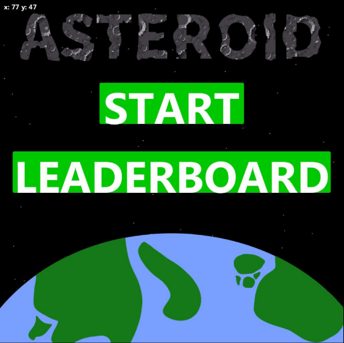
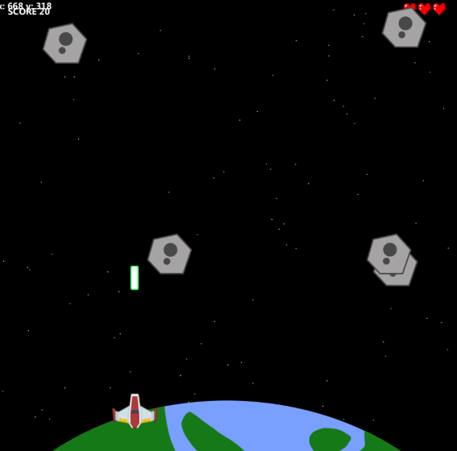
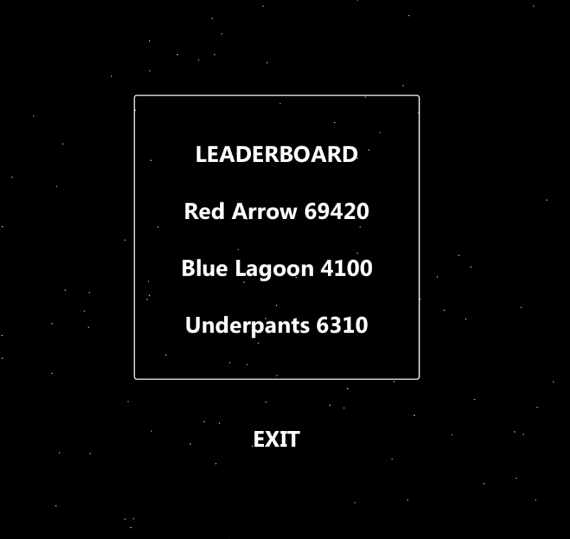

# Asteroid

A 2D arcade-style space shooter made using **Processing**.

The player controls a spaceship and must destroy incoming asteroids before losing all three lives. The game includes multiple spaceship colours, a username system, scoring, and a persistent top 3 leaderboard.

## Features

- 2D asteroid-shooting gameplay
- Multiple spaceship colours to choose from
- Username input with a maximum length of 12 characters
- Shooting and movement mechanics
- Three-life system
- Score system: 10 points for each asteroid destroyed
- Top 3 leaderboard
- Leaderboard data stored in a plain text file
- Start menu and leaderboard menu

## Screenshots

### Start Menu

### Gameplay

### Leaderboard

## How to Play

The objective is to destroy as many asteroids as possible while keeping all three lives.

### Controls

| Key | Action |
|---|---|
| `A` | Move left |
| `D` | Move right |
| `SPACE` | Shoot |

Each asteroid destroyed gives **10 points**.

The player's remaining lives are shown in the top-right corner, while the current score is displayed in the top-left.

## Starting the Game

When the game starts, the main menu gives you two options:

### Start

Selecting **Start** prompts you to enter a username and choose the colour of your spaceship.

Usernames are limited to **12 characters**.

After selecting your spaceship, press **Begin** to start playing.

### Leaderboard

The **Leaderboard** button displays the current top three scores.

Leaderboard information is stored in a plain text file and is loaded by the game.

## Installation

### Requirements

- [Processing](https://processing.org/download)
- The project files in this repository

### Setup

1. Download and install Processing.
2. Download or clone this repository.
3. Make sure all of the project files are kept together in the same folder.
4. Open the `.pde` file in Processing.
5. Press the **Run** button.

The game should then launch.

## Known Bugs

There is currently a known issue with rapidly pressing the spacebar.

If the spacebar is pressed repeatedly in quick succession, the shooting system can stop responding temporarily, preventing the player from shooting for a short period.

This is a known issue and does not prevent the rest of the game from functioning.

## Credits

### Spacecraft Graphics

The spaceship graphics are based on **Space Shooter** assets by **Kenney Vleugels**.

[Kenney](https://www.kenney.nl/)

The spaceship graphics were modified by changing their hue to provide different colour options in the game.

### Heart Graphic

The heart graphic was sourced from OpenGameArt:

[Heart Pixel Art](https://opengameart.org/content/heart-pixel-art)

## Project

This project was created as a 2D game development project using Processing.

It was also an opportunity to work with game mechanics such as player movement, shooting, collision detection, scoring, lives, menus, user input, and saving/loading leaderboard data.
